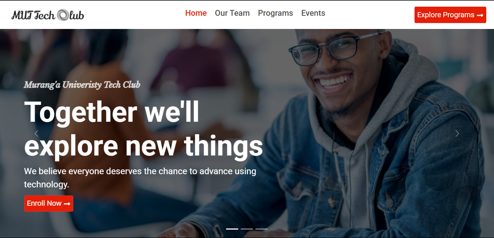

# WELCOME TO MURANG'A UNIVERSITY TECH CLUB

# 🚀 Getting Started
Welcome to the official website of the Murang'a University Tech Club (MUTC).

This project is built using React.js + Typescript to provide an interactive and engaging platform for students interested in programming, technology, and innovation.

## 🛠 Features
✅ Dynamic Hero Section – Features an engaging image with an interactive call-to-action button for new members to join MUTC.

✅ Structured Membership System – Allows students to sign up, track their learning progress, and receive updates on upcoming events.

✅ Automated Event Notifications – Sends reminders to registered members about upcoming workshops, training sessions, and club activities.

✅ Integrated Leadership Directory – Displays profiles of the leadership team with clickable social media links for networking.

✅ Track Enrollment System – Enables students to browse available tech tracks and register for specialized learning programs.

✅ Live Chat & Support – Provides a real-time chat feature or contact form for inquiries, mentorship, or troubleshooting assistance.

✅ Cross-Platform Accessibility – Ensures a smooth user experience on all devices, including mobile, tablet, and desktop.

## 📌 Prerequisites
Before running the project, ensure you have the following installed:

- Node.js (Download from [nodejs.org](https://nodejs.org/))
- npm or yarn (Comes with Node.js)
- React.js (Installed via Vite or Create React App)

## 🏆 Acknowledgments
A huge thank you to the Teach2Give Community for their contributions and support in making this website a success. 
